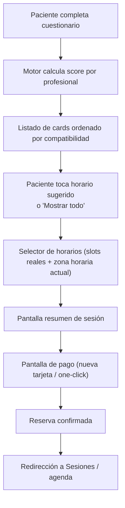

# Matching clínico explicado fácil (versión socios)

## 1) ¿Qué problema resuelve?
Cuando un paciente llega por primera vez, necesita encontrar rápido al terapeuta más adecuado.
El motor de matching ordena profesionales según:
- lo que el paciente cuenta en su cuestionario,
- lo que el terapeuta cargó en onboarding/perfil,
- la disponibilidad real de horarios.

Objetivo de negocio: mejorar conversión a primera sesión, continuidad terapéutica y satisfacción.

## 2) ¿Qué datos usa?
### Del paciente (intake)
- Motivo principal (ansiedad, depresión, vínculos, etc.)
- Objetivo terapéutico (texto libre)
- Estado emocional (texto libre)
- Enfoque preferido (por ejemplo TCC)
- Idioma
- Franja horaria preferida (mañana/tarde/noche/flexible)
- Experiencia previa en terapia

### Del profesional (DB, onboarding real)
- Especialización
- Foco principal
- Enfoque terapéutico
- Bio y título profesional
- Idiomas
- Años de experiencia
- Precio de sesión
- Horarios disponibles (slots)
- Métricas operativas (clientes activos, sesiones)

No se inventan datos en frontend: el card toma los campos reales del perfil del psicólogo.

## 3) ¿Cómo calcula el puntaje?
El score va de 1 a 99.

Base:
- Arranca en `35`.

Ajustes:
- Coincidencia por tema clínico: `+14` por tema (tope `+36`).
- Enfoque terapéutico:
  - si coincide con preferencia del paciente: `+14`
  - si el paciente “no está seguro”: `+6`
- Idioma:
  - coincide: `+12`
  - no coincide (cuando el paciente pide uno específico): `-8`
  - bilingüe: `+10` si profesional maneja 2+ idiomas, si no `+4`
- Franja horaria:
  - si coincide con slots reales: `+8`
  - si paciente es flexible y hay slots: `+6`
- Experiencia según historial del paciente: entre `+2` y `+5`.
- Compatibilidad base histórica del perfil: `+ round(compatibilityBase * 0.08)`.
- Rating (si existe): mejora extra por encima de 4.2.

Finalmente:
- se recorta a rango `1..99`,
- se ordena de mayor score a menor,
- en empate gana quien tiene horario más cercano.

## 4) ¿Qué explica al usuario?
No solo muestra número. También muestra razones concretas, por ejemplo:
- “Experiencia en ansiedad y burnout”
- “Su enfoque terapéutico coincide con tu preferencia”
- “Tiene horarios en tu franja horaria preferida”

Esto mejora confianza y reduce abandono.

## 5) Flujo de producto (nuevo)

## 6) Ejemplo real (simple)
Paciente:
- Motivo: ansiedad
- Objetivo: “quiero bajar ataques de pánico y estrés laboral”
- Preferencia: TCC
- Idioma: español
- Franja: mañana

Profesional A:
- Trata ansiedad y burnout
- Enfoque TCC
- Idioma español
- Tiene slots de mañana

Profesional B:
- No enfocado en ansiedad
- Sin TCC
- Slots solo de noche

Resultado:
- A queda arriba por score.
- Se muestran razones de por qué A es mejor match.
- Paciente reserva en menos pasos (slot -> resumen -> pago).

## 7) Impacto para socios (en negocio)
- Mejora tasa de primera reserva (menos fricción).
- Mejora calidad de asignación (más probabilidad de continuidad).
- Permite escalar sin asignación manual.
- Deja trazabilidad para optimizar métricas (qué factores convierten más).

## 8) Dónde está implementado
- Motor de score: `/apps/patient/src/modules/matching/matchingEngine.ts`
- Hook de filtros/orden: `/apps/patient/src/modules/matching/hooks/useProfessionalMatching.ts`
- Fuente de profesionales (API real): `/apps/patient/src/modules/matching/services/professionals.ts`
- API perfiles profesionales: `/apps/api/src/modules/profiles/profiles.routes.ts`
- Flujo UI (cards -> horarios -> resumen -> pago):
  - `/apps/patient/src/modules/matching/pages/PatientMatchingPage.tsx`
  - `/apps/patient/src/modules/matching/components/ProfessionalMatchCard.tsx`
  - `/apps/patient/src/modules/matching/components/AvailabilityPickerModal.tsx`
  - `/apps/patient/src/modules/matching/components/BookingSummaryModal.tsx`
  - `/apps/patient/src/modules/matching/components/PaymentMethodModal.tsx`
