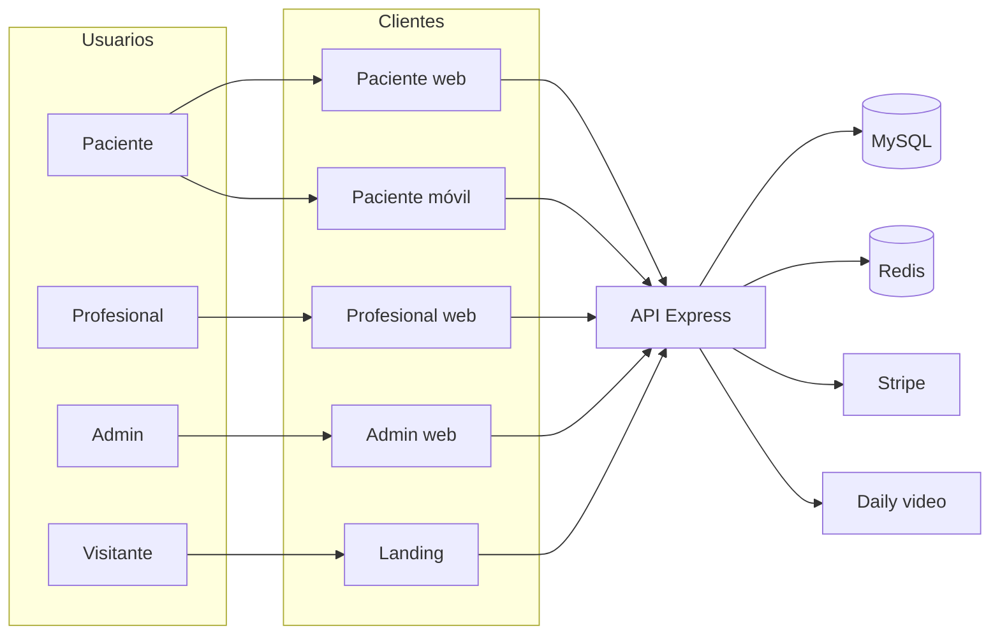
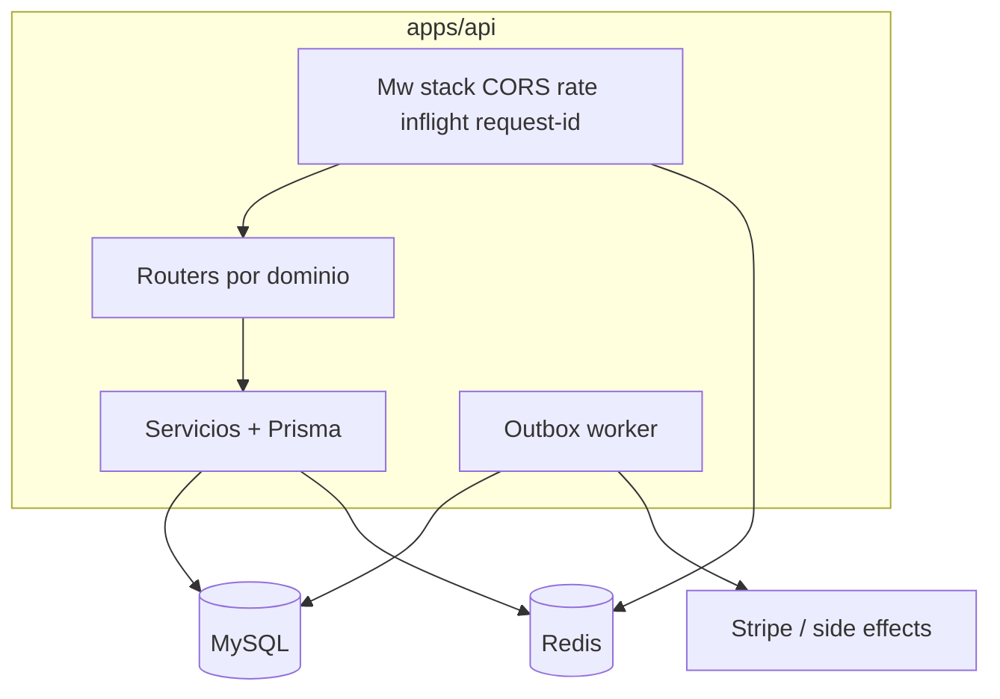

# MotivarCare / Therapy Platform — Arquitectura técnica (documento único)

**Audiencia:** arquitecto de software / líder técnico.  
**Propósito:** descripción **actual y verificable** del sistema, con profundidad técnica (datos, API, operación, riesgos y evolución). La **fuente de verdad** sigue siendo el código bajo `apps/` y `packages/`.

**Producto:** terapia online orientada a **EE. UU.**; superficies paciente, profesional y admin; **paquetes de sesiones**; **Stripe**; chat y reservas con disponibilidad.

---

## 1. Resumen ejecutivo

| Aspecto | Decisión actual |
|--------|------------------|
| Repositorio | **Monorepo** npm workspaces: `apps/*`, `packages/*` |
| Backend | **Monolito modular** Node + **Express** + **Prisma** (no microservicios) |
| Datos transaccionales | **MySQL** |
| Infra auxiliar | **Redis** (rate limit distribuido, locks de reserva, etc.) |
| Clientes | **React + Vite** (landing, paciente, profesional, admin) + **Expo** (paciente móvil) |
| Estilo de integración | Clientes llaman **directamente** a la API REST (sin BFF dedicado en MVP) |
| Versionado API | Montaje duplicado **`/api/*`** y **`/api/v1/*`** (mobile y contratos nuevos hacia `v1`) |

---

## 2. Vista de contexto (C4 nivel 1)

---

## 3. Mapa del monorepo

| Ruta | Rol |
|------|-----|
| `apps/api` | API REST, Prisma, workers outbox |
| `apps/patient` | Portal paciente web |
| `apps/patient-mobile` | App Expo |
| `apps/professional` | Portal profesional |
| `apps/admin` | Operación, usuarios, finanzas, contenido |
| `apps/landing` | Marketing |
| `packages/auth`, `types`, `utils`, `ui`, `database` | Contratos y utilidades compartidas |
| `infra/docker` | MySQL + Redis local |
| `infra/deploy` | Despliegue |

**Patrón en portales web:** `pages/`, `components/`, `hooks/`, `services/`, `types/`; bootstrap liviano vía `AppRoot`.

---

## 4. Backend: pipeline HTTP y capas transversales

Flujo típico de request (orden conceptual en `app.ts`):

1. Headers de seguridad (`nosniff`, `X-Frame-Options`, CSP mínima en API, `CORP: cross-origin` para clientes nativos en LAN).
2. **CORS** (allowlist + orígenes `localhost` en dev).
3. **JSON body** con límite alto (~35 MB), **excluyendo** raw body en webhooks Stripe.
4. **Shutdown gate** (503 si el proceso está cerrando).
5. **Rate limiting** por IP (Redis; fallback según config).
6. **Techo de requests en vuelo** (`API_MAX_INFLIGHT_REQUESTS`).
7. **Request ID** (`x-request-id`).
8. **Access logs** JSON opcionales (`API_ACCESS_LOG_ENABLED`).
9. **Métricas HTTP** por request (histogramas Prometheus si `API_METRICS_ENABLED`).

**Proceso de arranque / parada:** `server.ts` — timeouts HTTP explícitos, **graceful shutdown** (cerrar server → drenar in-flight → `prisma.$disconnect` + Redis). Ver `apps/api/src/server.ts`.

---

## 5. Módulos de dominio y montaje de rutas

Routers montados bajo **`/api`** y **`/api/v1`** (misma superficie, duplicada para compatibilidad):

| Ruta montada | Contenido |
|--------------|-----------|
| `/auth` | Registro, login, sesión, perfil de cuenta |
| `/profiles` | Perfiles, intake, matching **server-side**, directorio |
| `/availability` | Slots y bloqueos |
| `/bookings` | Reserva, reprogramación, cancelación |
| `/payments` | Stripe checkout + webhook |
| `/video` | Sesión de videollamada por booking (**Daily** en flujo actual); servicio **Google Meet** en código para extensión |
| `/chat` | Hilos y mensajes 1:1 |
| `/professional` | Dashboard y operación profesional |
| `/admin` | Operación, KPIs, usuarios, paquetes, web, **y submódulo finance** |
| `/public` | Endpoints públicos |
| `/ai-audit` | Auditoría IA (evolutivo) |

**Finanzas (admin):** `adminRouter.use("/finance", financeRouter)` → ej. `GET/PATCH …/admin/finance/settings`, overview, agregados, Stripe events, **payout runs** y líneas. Protección **`requireRole(["ADMIN"])`** en el router de finanzas.

---

## 6. Límites de dominio (lenguaje ubiquo)

Alineado con cómo está organizado el código y con la evolución razonable del monolito:

1. **Identity & Access** — usuarios, roles, JWT, verificación de email.  
2. **Care Operations** — pacientes, profesionales, intake, riesgo, disponibilidad, reservas.  
3. **Commerce & Payments** — paquetes, compras, créditos, Stripe, ledger de créditos.  
4. **Finance** — registro por sesión (`FinanceSessionRecord`), comisiones configurables, corridas de liquidación, líneas y cierre.  
5. **Comms** — chat, notificaciones (email/in-app), recordatorios.  
6. **Content** — landing settings, artículos, reviews (admin/web).

---

## 7. Modelo de datos (OLTP)

### 7.1 Entidades núcleo

- Identidad y perfiles: `User`, `PatientProfile`, `ProfessionalProfile`, `AdminProfile`; verificación (`VerificationToken`, flags de email).
- Operación clínica: `AvailabilitySlot`, `Booking`, `VideoSession`, `PatientIntake`, `ChatThread`, `ChatMessage`.
- Comercio: `SessionPackage`, `PatientPackagePurchase`, `CreditLedger`, `SystemConfig`.
- Finanzas: `FinanceSessionRecord`, `FinancePayoutRun`, `FinancePayoutLine`, `FinanceDailyAggregate` (según esquema).
- Asíncrono: **`OutboxEvent`** (webhooks Stripe y otros efectos secundarios).

### 7.2 Reglas financieras (visión técnica)

- **`FinanceSessionRecord`:** típicamente una fila por sesión monetizable en estado **COMPLETED**; guarda brutos, fee plataforma, neto profesional, flags trial, referencias a booking/paquete.
- **Trial vs regular:** porcentajes configurables (`trialPlatformPercent`, `platformCommissionPercent`, etc. vía API admin finance settings).
- **Payout:** `FinancePayoutRun` agrupa período; `FinancePayoutLine` por profesional; idempotencia en creación de corrida (`X-Idempotency-Key` + constraints); transiciones de cierre coherentes (no cerrar con pendientes).

### 7.3 Índices relevantes (consultas calientes)

- `Booking(patientId, startsAt)`, `Booking(professionalId, startsAt)`  
- `FinanceSessionRecord(bookingCompletedAt)`, compuestos por `professionalId` / `patientId` + fecha  
- `FinancePayoutLine(payoutRunId, professionalId)`

### 7.4 Mejoras de modelo recomendadas (deuda / evolución)

1. Moneda por transacción + snapshot FX.  
2. `PaymentTransaction` normalizada (captura, refund, chargeback).  
3. `FinanceJournalEntry` (doble entrada) para auditoría estricta.  
4. Snapshots diarios ya usados o ampliados para dashboards sin escanear ledger completo.  
5. Soft delete / `archivedAt` en entidades operativas.

---

## 8. Concurrencia, idempotencia y consistencia

| Mecanismo | Uso |
|-----------|-----|
| **Transacciones Prisma** | Operaciones multi-tabla (reserva + débito de crédito, corridas de payout, etc.) |
| **Idempotency-Key** | POST críticos (payout runs; extender mentalmente a compras/bookings según rutas) |
| **Lock distribuido Redis** | Doble reserva sobre el mismo slot (`API_BOOKING_LOCK_TTL_MS` u homólogo en código) |
| **Precondiciones de estado** | Updates `WHERE status = …` para evitar carreras en máquinas de estados |
| **Outbox** | Publicación at-least-once hacia handlers; dedupe Stripe `stripe:event:<id>` |

---

## 9. Procesamiento asíncrono (outbox)

- Webhook **Stripe** valida firma (cuando `STRIPE_WEBHOOK_SECRET` está configurado); procesamiento pesado **no bloquea** el ACK: eventos entran al **outbox**.  
- Worker dedicado (ej. `npm run dev:outbox -w @therapy/api` en desarrollo): polling, batch, reintentos exponenciales, estado **DEAD_LETTER** tras máximo de intentos.  
- Variables típicas: `OUTBOX_POLL_MS`, `OUTBOX_BATCH_SIZE`, `OUTBOX_MAX_ATTEMPTS`, `OUTBOX_RETRY_BASE_MS`.  
- **Producción:** API y worker como **procesos separados**; monitorizar `PENDING` creciente y `DEAD_LETTER > 0`.

Módulos de notificación (`apps/api/src/modules/notifications/*`) participan en el ciclo de vida de reservas y mensajes (email / in-app según implementación).

---

## 10. Zona horaria (contrato técnico)

- Cliente expone timezone vía `Intl.DateTimeFormat().resolvedOptions().timeZone`; se persiste `lastSeenTimezone` en perfiles.  
- En **booking** se guardan snapshots: `patientTimezoneAtBooking`, `professionalTimezoneAtBooking`.  
- Backend trabaja en **UTC** en almacenamiento; la UI renderiza en zona del usuario.

---

## 11. Contrato API (`/api/v1`)

**Base:** prefijo recomendado **`/api/v1/*`** para clientes nuevos; **`/api/*`** legado, mismo comportamiento montado en paralelo.

### Headers

| Header | Uso |
|--------|-----|
| `Authorization: Bearer <token>` | Rutas protegidas |
| `X-Request-Id` | Opcional; trazabilidad (si no viene, la API puede generar) |
| `X-Client-Version` | Recomendado en mobile |
| `X-Idempotency-Key` | **Obligatorio** en POST críticos (payouts, etc.) |

### Módulos principales (lista de referencia)

**Auth:** `POST …/auth/register`, `login`, `GET …/auth/me`, `PATCH …/auth/me`, `change-password`.

**Profiles:** `GET …/profiles/professionals`, `GET …/profiles/me`, `POST …/profiles/me/intake`, `PATCH …/profiles/professional/:professionalId/public-profile`.

**Availability / Bookings:** slots CRUD bajo `availability`; `GET …/bookings/mine`, `POST …/bookings`, reschedule, cancel.

**Payments:** `POST …/payments/stripe/checkout-session`, `POST …/payments/stripe/webhook`.

**Finance (admin):** `GET/PATCH …/admin/finance/settings`, rebuild session records, `overview`, `payouts/runs` CRUD, `mark-paid`, `close`, etc.

### Recomendaciones para mobile

1. Paginación consistente (`cursor` o `page/pageSize`) en listados.  
2. Errores normalizados: `code`, `message`, `requestId`, `details`.  
3. Compatibilidad en `v1`: no romper campos existentes sin nueva versión.  
4. Fechas en ISO UTC + timezone del usuario donde aplique en UI.

---

## 12. Integraciones externas

| Sistema | Rol |
|---------|-----|
| **MySQL** | Verdad transaccional |
| **Redis** | Rate limit, locks, coordinación |
| **Stripe** | Cobro, webhooks, conciliación vía outbox |
| **Daily** | Salas de video en `video` routes |
| **Google Meet** | Servicio en código para proveedor alternativo |
| **Object storage** | Recomendado a escala para media (hoy parte del admin usa payloads base64 / grandes JSON) |

**Checklist producción (integraciones):** validación de firma webhook; persistencia e idempotencia de eventos; storage externo para archivos; políticas de retención/borrado.

---

## 13. Seguridad (vista implementada)

- JWT Bearer; contexto de actor en `lib/auth` / `lib/actor`.  
- CORS restrictivo en prod (`CORS_ORIGINS`).  
- Rate limit login y global.  
- Chat acotado a relaciones válidas paciente–profesional.  
- Intake con **screening de riesgo** (bloqueo de reserva): implicancias de datos sensibles y cumplimiento a revisar con asesoría legal/DPO según jurisdicción.

---

## 14. Observabilidad y operación

| Recurso | Descripción |
|---------|-------------|
| `GET /health/live` | Liveness |
| `GET /health/ready` | Readiness (DB, Redis según implementación) |
| `GET /metrics` | Prometheus (si `API_METRICS_ENABLED`) |
| Logs | JSON estructurados opcionales con `x-request-id` |

**Alarmas mínimas sugeridas:** `DEAD_LETTER > 0`; error rate > umbral; p99 latencia; `/health/ready` 503.

**Variables operativas (ejemplos):** ver `apps/api/.env.example` — `API_RATE_LIMIT_*`, `API_AUTH_LOGIN_*`, `API_MAX_INFLIGHT_REQUESTS`, `API_METRICS_ENABLED`, `API_ACCESS_LOG_ENABLED`, `STRIPE_*`, `JWT_SECRET`, `NODE_ENV`, `TRUST_PROXY`.

**Carga de prueba local:** `npm run load:smoke` (variables `LOAD_BASE_URL`, `LOAD_CONNECTIONS`, etc.).

---

## 15. Escalado y alta disponibilidad (resumen)

**Antes de escalar en serio:** ≥2 réplicas API detrás de balanceador; MySQL y Redis **gestionados**; backups PITR; healthchecks live/ready; endurecer CORS y secretos; tunear rate limit tras pruebas de carga.

**Mediano plazo:** métricas en dashboards; logs centralizados con correlación; alertas; chat eventualmente **WebSocket** vs polling; outbox worker monitoreado; despliegue blue/green o rolling; WAF / rate limit en edge; idempotencia extendida; read replicas para reporting; cola dedicada (BullMQ/Kafka) si el outbox interno queda corto.

**Objetivos no funcionales de diseño (objetivo negocio/técnico):** p95 reads &lt; ~250 ms, writes &lt; ~450 ms, disponibilidad 99.9%, RPO/RTO acordados (ver sección histórica consolidada: RPO &lt; 15 min, RTO &lt; 60 min como north star).

---

## 16. Evolución del sistema (roadmap técnico por fases)

**Fase A (base — en gran parte hecha):** ledger por sesión, comisiones configurables, payout runs, `/api/v1`, idempotencia en payout.

**Fase B (cercana):** OpenAPI publicado; contrato de error uniforme; agregados diarios explícitos en reporting; exports CSV; modularización fuerte de `finance` y routers admin muy grandes.

**Fase C (escala):** bus de eventos para trabajo async pesado; read replicas; cache en lecturas públicas calientes; circuit breakers hacia Stripe/Daily; feature flags por cliente móvil; trazas distribuidas y alerting completo.

**Fase D (frontend):** tests de journeys críticos; guía de convenciones para futuras apps nativas; reducción de hotspots (landing monolítica, `admin.routes.ts` masivo, etc.).

---

## 17. Riesgos y deuda técnica visible

- **Archivos muy grandes** (ej. `admin.routes.ts`, `bookings.routes.ts`, `finance.service.ts`, landing `App.tsx`): elevan costo de cambio y riesgo de regresión; mitigación = sub-routers y capa servicio/repositorio ya usada en finanzas.  
- **Reporting** que fuerza agregaciones pesadas sobre tablas OLTP sin modelo de lectura dedicado.  
- **OpenAPI / contrato formal** aún no es el canal único de verdad para mobile.  
- **Media en DB** como base64 a escala: migrar a object storage.

---

## 18. Diagrama lógico API ↔ datos (C4 nivel 2 simplificado)

---

## 19. Preguntas para revisión con arquitecto

1. ¿Cuándo introducir **BFF** o **API Gateway** frente a N clientes nativos?  
2. ¿Límite del patrón **outbox en MySQL** vs cola externa dedicada?  
3. Estrategia **multi-proveedor de video** y límites de vendor lock-in.  
4. Cumplimiento (**HIPAA** u otros): clasificación de datos, retención, encryption at rest, BAA con proveedores.  
5. **SLO/SLA** formales y error budget por dominio (pagos vs chat vs admin).

---

## 20. Nota de mantenimiento

Documento consolidado **abril 2026**. Sustituye la documentación dispersa de arquitectura previa en este repositorio. Otros materiales en `docs/` (roadmap de producto, preguntas abiertas, demos) no son arquitectura de plataforma.

Para convenciones de carpetas y scripts de desarrollo, ver **`README.md`** en la raíz del monorepo.
